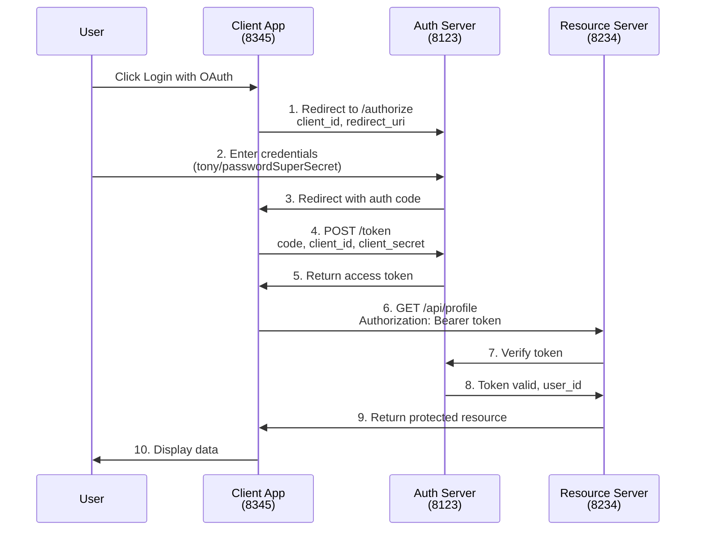

# OAuth 2.0 Authorization Code Grant Type Demo

A simple educational demonstration of the OAuth 2.0 Authorization Code Grant Type flow using Python and Flask.

## Overview

This project implements a complete OAuth 2.0 Authorization Code Grant Type flow with three components:
- Authorization Server (auth_server.py)
- Resource Server (resource_server.py)
- Client Application (client.py)

## Flow Diagram

