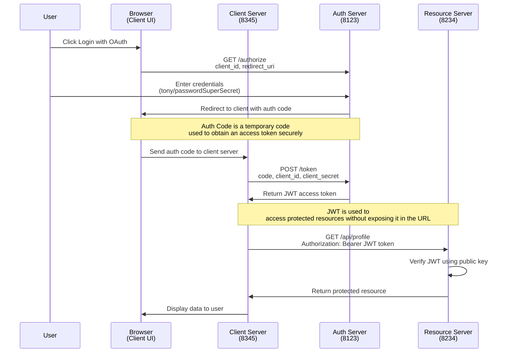

# OAuth 2.0 Authorization Code Grant Type Demo

A simple educational demonstration of the OAuth 2.0 Authorization Code Grant Type flow using Python and Flask.

## Overview

This project implements a complete OAuth 2.0 Authorization Code Grant Type flow with three components:
- Authorization Server (auth_server.py)
- Resource Server (resource_server.py)
- Client Application (client.py)

## Enhanced Flow Diagram

This diagram illustrates the OAuth 2.0 flow, emphasizing the role of the authorization code in securely exchanging user credentials for an access token. It highlights the separation between the browser and client server, ensuring the access token is not exposed in the URL and is verified locally using a public key.
